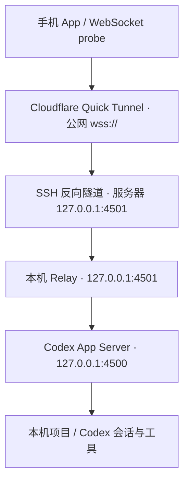

# Codex Mobile Remote 故障排查与解决方法手册

> 本手册汇总 `docs/` 目录下全部文档中记录的运行期故障、根因分析与解决方法，按**链路分层**重新组织，便于直接检索。
>
>
> 最后整理：2026-09-14
>
> **更新记录**
> - 2026-09-14：新增【F15】`/readyz` 200 但 WebSocket `1006` / `HTTP 530`（Cloudflare Quick Tunnel QUIC 超时）；补充「本机 Tunnel + 强制 HTTP/2」接入路径、公网 WebSocket 健康检查、失效地址识别与重连上限。

---

## 0. 链路全景

所有故障都挂在这条链路上。**排查必须逐层往下走，不要跳层**，也不要跳过未验证的层直接去测手机端。



### 两种接入路径

| 路径 | `cloudflared` 位置 | 传输协议 | 中间环节 | 说明 |
| --- | --- | --- | --- | --- |
| A | 远程服务器 | 默认 `auto`（优先 QUIC） | SSH 反向隧道 → 服务器 `127.0.0.1:4501` | 见 `remote-codex-quick-tunnel.md`；QUIC 频繁超时会直接导致【F15】 |
| B（当前采用） | Windows 本机 | **强制 HTTP/2** | 直连本机 `127.0.0.1:4501` | 绕开 QUIC 超时；该路径下 SSH 反向隧道与服务器侧 Quick Tunnel 不再参与手机流量转发 |

| 层 | 组件 | 端口 | 正常状态 |
| --- | --- | --- | --- |
| L1 | Codex App Server | `127.0.0.1:4500` | 处于 `Listen` |
| L2 | 本机 Relay | `127.0.0.1:4501` | **仅** `127.0.0.1:4501` 处于 `Listen`，`/readyz` 立即返回 `ok` |
| L3 | SSH 反向隧道 | 服务器 `127.0.0.1:4501` | 处于监听，`/readyz` 立即返回 `ok`（仅路径 A 需要） |
| L4 | Cloudflare Tunnel | 公网 `wss://` | `/readyz` 返回 `ok`，且 WebSocket 能完成升级与初始化 |
| L5 | WebSocket 全链路 | — | probe 返回 `"ok": true` |
| L6 | 手机 App | — | 状态为已连接，而非持续 `connecting` |

**核心判据：`/readyz` 返回 `ok` 只代表 HTTP 健康检查正常，不代表链路可用。** 必须再跑一次 WebSocket probe 才能确认。**`/readyz` 返回 200 但 WebSocket 报 `1006` / `HTTP 530`，见【F15】。**

---

## 1. 分层判断树（先定位，再修）

```text
Codex App Server 4500 是否监听？
        │
        ├─ 否 → 【F1】App Server 问题
        ▼
Windows 4501 /readyz 是否 ok？
        │
        ├─ 否 → 【F3】Relay / 端口冲突问题
        ▼
Server 4501 /readyz 是否 ok？（仅路径 A 需要）
        │
        ├─ 否 → 【F6】SSH Reverse Tunnel 问题
        ▼
trycloudflare /readyz 是否 ok？
        │
        ├─ 否 → 【F7】/【F8】/【F9】cloudflared / Quick Tunnel 问题
        ▼
WebSocket 升级是否成功？（不要只看 /readyz）
        │
        ├─ 否，报 1006 / HTTP 530 → 【F15】Tunnel 传输层问题（QUIC 超时 / 地址失效）
        ▼
probe-app-server 是否 ok？
        │
        ├─ 否 → 【F10】WebSocket / Token / App Server 协议问题
        ▼
手机是否正常连接？
        │
        ├─ 否 → 【F11】/【F12】/【F14】手机 URL / 缓存配置 / 写权冲突
        ▼
成功
```

---

## 2. 故障清单

### F1 · Codex App Server 未监听 → `Connection refused`

**现象**：`Connection refused`；或 probe 直接连不上上游。

**根因**：`127.0.0.1:4500` 没有程序监听，通常是 App Server 未启动或已退出。

**定位**：

```powershell
Get-NetTCPConnection -LocalPort 4500 -State Listen
```

应能看到 `127.0.0.1:4500`。

**解决**：

```powershell
codex app-server `
  --listen ws://127.0.0.1:4500 `
  --ws-auth capability-token `
  --ws-token-file "$env:USERPROFILE\.codex\app-server\mobile.token"
```

**注意**：App Server 只监听 `127.0.0.1:4500`，**不要直接暴露 4500 到局域网或公网**。

---

### F2 · `thread not found`

**现象**：直接对某个会话调用 `turn/start` 时报 `thread not found`。

**根因**：`thread/list` 返回的 thread 可能是 `status.type === "notLoaded"` —— 只存在于列表中，尚未加载到 App Server 内存。

**解决**：项目已有两条规则，必须保留：

1. **打开详情前先 `thread/resume`**；
2. **发送消息前再做一次 defensive resume**。

```json
{ "method": "thread/resume", "params": { "threadId": "<thread-id>" } }
```

**相关**：手机端"重新获取询问"按钮也是强制执行 `thread/resume`，用于同一 App Server 的断线重连场景恢复未决请求。

---

### F3 · 本机 Relay 异常：`/readyz` 长时间无响应、4501 端口冲突

**现象**：

- Windows 上 `curl.exe --max-time 5 http://127.0.0.1:4501/readyz` 长时间无响应；
- `Get-NetTCPConnection -LocalPort 4501 -State Listen` 同时出现 `127.0.0.1:4501` 和 `0.0.0.0:4501`；
- 存在多个不同 PID 监听 4501。

**根因**：旧 Relay 残留、重复启动脚本、或其他残留进程。Relay 正常情况下**只应监听 `127.0.0.1:4501`**，出现 `0.0.0.0:4501` 说明暴露面也错了。

**定位**：

```powershell
Get-NetTCPConnection -LocalPort 4501 -State Listen |
  Select-Object LocalAddress,LocalPort,OwningProcess

Get-CimInstance Win32_Process |
Where-Object {$_.ProcessId -in (
  Get-NetTCPConnection -LocalPort 4501 -State Listen
).OwningProcess} |
Select-Object ProcessId,Name,CommandLine
```

**解决**：确认某个 PID 为旧 Relay 后单独停止：

```powershell
Stop-Process -Id <旧PID>
```

**注意**：

- **不要直接结束所有 `node.exe`**，会误杀其他 Node.js 程序；
- 4501 应由当前 `node scripts\app-server-relay.mjs` 对应的进程监听；
- 本机未返回 `ok` 前，**不要继续测试服务器或手机**，否则会叠加多个故障。

---

### F4 · `readyz` 返回 200，但 WebSocket 握手 `403`

**现象**：真机上 `/readyz` 正常返回，但 WebSocket 握手报 `403`。

**根因**：`--ws-auth capability-token` 要求 WebSocket 握手带 `Authorization: Bearer <token>`，而 **iPhone / Expo Go 环境下 React Native 的 WebSocket 可能不会把这个 header 可靠带出去**。

**解决**：改连本机 relay，由 relay 注入上游 bearer token。

```bash
RELAY_TOKEN=dev-bridge \
UPSTREAM_WS_URL=ws://<your-mac-lan-ip>:4500 \
UPSTREAM_TOKEN_FILE=~/.codex/app-server/mobile.token \
pnpm relay:app-server
```

手机端连接：

```text
ws://<your-mac-lan-ip>:4501?relay_token=dev-bridge
```

此时 **App 里的 token 输入框留空即可**。

**先自检再上手机**：

```bash
CODEX_APP_SERVER_URL='ws://<your-mac-lan-ip>:4501?relay_token=dev-bridge' \
node scripts/probe-app-server.mjs
```

只要能返回 `ok: true` 和 `threads.count`，手机端也应该走得通。

> **易混点**：同样是"`/readyz` 200 但 WebSocket 失败"，【F4】报 `403`，是握手没带上 token，查 token；【F15】报 `1006` / `530`，是公网 Tunnel 传输层失效，查传输协议与地址有效期。

---

### F5 · `/healthz` 带 `Origin` header 返回 `403 Forbidden`（**不是故障**）

**现象**：带 `Origin` header 请求 `/healthz` 得到 `403`。

**根因**：官方设计如此，属于预期行为，不是配置错误。

**解决**：无需处理。**移动端健康检测统一使用 `/readyz`**；`/healthz` 只在没有 `Origin` header 时返回 `200 OK`。

---

### F6 · 本机 `ok`，服务器失败 → SSH 反向隧道异常

**现象**：Windows 本机 `127.0.0.1:4501/readyz` 返回 `ok`，但服务器上 `127.0.0.1:4501/readyz` 失败或 `Connection refused`。

**根因**：SSH 反向隧道断开、旧隧道残留，或服务器 4501 并非由 SSH 转发监听（被别的进程占了）。

**定位**：

```bash
ss -ltnp | grep ':4501'
curl --max-time 5 -i http://127.0.0.1:4501/readyz
```

监听地址应为 `127.0.0.1:4501`。另需确认服务器 SSH 允许 TCP 转发：

```bash
sshd -T | grep -E 'allowtcpforwarding|gatewayports'
```

必须包含 `allowtcpforwarding yes`。

**解决**：重新建立隧道。

```powershell
ssh.exe -N `
  -o ExitOnForwardFailure=yes `
  -o ServerAliveInterval=30 `
  -o ServerAliveCountMax=3 `
  -R 127.0.0.1:4501:127.0.0.1:4501 `
  root@<服务器 IP>
```

映射关系：服务器 `127.0.0.1:4501` → Windows 本机 `127.0.0.1:4501`。反向端口只绑到服务器 `127.0.0.1`，**不需要对公网开放 4501**。

> 若固定在路径 B（本机 Tunnel + HTTP/2）上运行，本条目不再处于手机流量的关键链路上。

---

### F7 · `502 Bad Gateway`

**现象**：公网访问返回 `502 Bad Gateway`。

**根因**：Cloudflare 无法正常访问配置的源站。

**解决**：检查 `cloudflared` 进程与服务器 `127.0.0.1:4501` 是否可达。

```bash
pgrep -af '[c]loudflared'
tail -n 80 /tmp/codex-mobile-cloudflared.log
```

**易混点**：`Root path /` 显示 `not found` 与 `502` 完全不同 —— 前者是 Relay 未提供网页根路径，**通常不是故障**，改用 `/readyz` 检查即可。

---

### F8 · `524` / 连接超时 / 手机一直 `connecting`（Quick Tunnel 旧地址）

**现象**：`524`、连接超时，或手机 App 持续处于 `connecting` 状态。

**根因**：**Quick Tunnel 每次 `cloudflared` 进程重启都会生成新的随机地址**。如果服务器上的 `cloudflared` 已重启，而手机 App 自动恢复了上一次保存的旧 `trycloudflare.com` 地址，就会出现这类现象。`524` 的含义是"Cloudflare 已建立连接，但后端长时间未返回"。

**解决**：

1. 在服务器重新读取当前 Quick Tunnel 地址：

   ```bash
   grep -Eo 'https://[-a-z0-9]+\.trycloudflare\.com' \
     /tmp/codex-mobile-cloudflared.log | tail -n 1
   ```

2. 在手机 App 中**清除旧的保存配置**；
3. 填入新的 `wss://...trycloudflare.com` 地址；
4. 重新执行 `readyz` 检查后再连接。

**注意**：不要仅依赖手机 App 自动恢复的旧地址。长期使用固定地址应改用 Cloudflare Named Tunnel + 自有域名。

**与 F15 的区别**：`524` 是"连接已建立但后端不返回"；`1006` / `530` 是"WebSocket 升级与传输阶段就失败"，根因在 Tunnel 传输协议，处置见【F15】。

---

### F9 · TLS 建立前断开

**现象**：TLS 握手完成前连接就断开。

**根因**：域名错误、Quick Tunnel 地址失效，或网络异常。

**解决**：核对当前 `trycloudflare.com` 地址是否为服务器正在使用的地址，并检查 `cloudflared` 状态（同 F8 / F15）。

---

### F10 · 公网 `/readyz` 正常，但 probe 失败

**现象**：三层 `/readyz` 全部 `ok`，但 `node scripts/probe-app-server.mjs` 返回失败。

**根因**：HTTP 层正常，问题在 **WebSocket / 认证 / App Server 协议链**。

**解决**：按序排查以下 5 项：

1. `relay.token` 是否正确；
2. Relay 是否能连接 `127.0.0.1:4500`；
3. `mobile.token` 是否与 App Server 启动时使用的 token 一致；
4. App Server 是否仍在运行；
5. 当前填写的 Quick Tunnel 地址是否已过期。

**验证命令**：

```powershell
$relay = (
  Get-Content "$env:USERPROFILE\.codex\app-server\relay.token" -Raw
).Trim()

$env:CODEX_APP_SERVER_URL = "wss://你的当前地址.trycloudflare.com?relay_token=$relay"

node scripts\probe-app-server.mjs
```

正常应看到 `"ok": true`。

**协议层补充**：初始化流程也必须正确 —— 每个连接必须**先发送一次 `initialize`**，成功后再发送 `initialized` notification；**初始化前发送其他 request 会被拒绝**。

---

### F11 · 公网 `ok`，手机仍无法连接

**现象**：公共链路全部验证通过，但手机端连不上。

**根因**：手机端配置或缓存异常 —— 尤其是保存了过期的 Quick Tunnel 地址。

**解决**：清除手机端保存的连接配置，填入当前 Quick Tunnel 地址。若手机显示"已恢复保存的连接配置"，必须确认其中的地址仍是服务器当前正在使用的地址。

**相关预防**：客户端已做 URL / token 拆分，用户不需要手动拼 `?relay_token=`；token 由 `expo-secure-store` 保存，不使用普通 AsyncStorage。

---

### F12 · `already has an active writer`（跨 App Server 写权冲突）

**现象**：从手机发送普通消息时报：

```text
already has an active writer
```

**触发条件**：任务由**电脑端启动**并进入计划模式的用户询问，`item/tool/requestUserInput` 询问请求发给了**电脑端连接**，手机端只看到线程仍处于活动状态。

**根因**：手机端与电脑端正在使用**不同的 Codex App Server 写入者**，同一 thread 被另一个进程持有。**这不是 Cloudflare、SSH 或 Relay 链路故障。**

**能力边界**：`app-codexapp` 已能处理 `item/tool/requestUserInput`（接收请求、显示问题卡片、按原请求 ID 提交回答），但**不能可靠接管由另一个 App Server 进程持有的进行中电脑端任务**。

**解决（按推荐度排序）**：

| 方案 | 改动量 | 能否回答电脑端已启动任务的询问 |
| --- | --- | --- |
| 统一从手机端启动可能需要追问的任务 | 无 | 可以 —— 询问会发给手机持有的连接 |
| 使用官方 Codex Remote | 无代码改动 | 可以，**推荐** |
| 增加"外部写入者"提示 | 很小 | 不可以 —— 但能消除误解、避免反复发送 |
| 电脑 CLI 与手机共用同一个 App Server | 较小 | 需联调验证 |
| 保留桌面 GUI 并由自制手机端接管 | 较大 | 可以 —— 需实现跨客户端转发与回答路由 |

**官方 Remote 路径**：在 Windows 的 ChatGPT 桌面应用中进入 `设置 → 连接 → 控制此 Mac 或 PC → 设置 / 添加`，用同一账户的手机应用扫描二维码，在手机"远程"页面选择该电脑。

**保留自制手机端的功能性调整**：让电脑和手机共用一个已启动的 App Server，避免两个独立 App Server 竞争同一线程写入权。

```text
同一个 codex app-server（127.0.0.1:4500）
├─ 电脑端：codex --remote ws://127.0.0.1:4500
└─ 手机端：Relay → Cloudflare Tunnel（路径 B 直连本机 4501）
```

代价：不保留 Codex Desktop App 的原生 GUI。

**最小源码补丁（防止误发送）**：预计改动 2～3 个文件、30～60 行。

1. 在 `apps/mobile/src/hooks/useCodexAppServer.ts` 中检测：

   ```ts
   selectedThread?.status.activeFlags.includes("waitingOnUserInput")
   && !userInputRequest
   ```

   将状态标记为"其他客户端持有的用户输入请求"。

2. 在 `apps/mobile/src/components/ThreadDetail.tsx` 中显示说明卡片：

   ```text
   此任务正在电脑端等待回答。
   手机没有收到原始问题，不能用普通消息替代回答。
   请在电脑端回答、停止该回合，或尝试重新获取询问。
   ```

3. 禁用普通发送按钮，提供"重新获取询问"按钮（强制执行 `thread/resume`）。

现有的 `item/tool/requestUserInput` 接收与回答逻辑**不需要重写**：`apps/mobile/src/lib/jsonRpcClient.ts`、`apps/mobile/src/components/user-input/UserInputRequestCard.tsx`。

---

### F13 · 计划模式询问在手机端收不到（`waitingOnUserInput` 但无问题卡片）

**现象**：thread 状态显示"等待输入"，但手机端没有出现可回答的问题卡片。

**根因**：同 F12 —— 原始询问请求发给了另一个 App Server 连接，手机端拿不到请求体。

**解决**：不要试图用普通消息替代回答。按 F12 的三条路径处理（统一从手机启动 / 用官方 Remote / 共用同一个 App Server）。

**判别依据**：`status.type === "active"` 且 `status.activeFlags` 含 `waitingOnUserInput`，但同时 `!userInputRequest`，即为"其他客户端持有"。

---

### F14 · `thread/turns/items/list` 返回 `unsupported`

**现象**：调用该接口返回 `unsupported`。

**根因**：该接口文档明确标注为 **reserved**，当前不可用。

**解决**：改用稳定路径 `thread/turns/list`，取 `sortDirection: "desc"` 后本地 reverse，保证时间线从旧到新显示。

```json
{
  "method": "thread/turns/list",
  "params": {
    "threadId": "<thread-id>",
    "cursor": null,
    "limit": 4,
    "sortDirection": "desc",
    "itemsView": "full"
  }
}
```

---

### F15 · `/readyz` 返回 200，但 WebSocket 报 `1006` / `HTTP 530`，手机持续"连接中"

**现象**：

- 手机端 `/readyz` 返回 `200`；
- WebSocket 连接失败，报错 `1006`（异常关闭）或 `HTTP 530`；
- 界面持续停留在"连接中"，不会给出明确的失败结论；
- 公网地址侧可能出现 Cloudflare `1033` / `530`。

**根因**（两层叠加）：

1. **服务端**：服务器上的 Cloudflare Quick Tunnel 使用 QUIC 传输时频繁超时，导致公网地址返回 Cloudflare `1033` / `530`。`cloudflared` 默认 `--protocol auto` 会优先选择 QUIC，因此这是默认配置下的常见坑。
2. **客户端**：手机端不断重试已失效的地址，于是故障表现为长时间"连接中"，而不是一次明确的失败提示。

**排查**：

- 服务端：确认当前 Quick Tunnel 地址是否仍有效，检查 `cloudflared` 日志中的超时 / 重连记录。`1033` / `530` 表示公网侧无法正常到达源站。
- 客户端：`/readyz` 返回 200 只说明 HTTP 层被响应；`1006` / `530` 出现在 **WebSocket 升级与传输阶段**。这正是 §0 的核心判据 —— 判定可用性必须依赖 WebSocket probe，不能只看 `/readyz`。

**解决方法**：

1. **改用本机 Cloudflare Tunnel**：把 `cloudflared` 从远程服务器移到 Windows 本机，直接指向本机 relay。

   ```powershell
   cloudflared tunnel --protocol http2 --url http://127.0.0.1:4501
   ```

2. **强制使用 HTTP/2（关键）**：`--protocol http2` 绕开 QUIC 传输，避免 QUIC 频繁超时导致的 `1033` / `530`。不要再依赖默认的 `auto`。

3. **增加公网 WebSocket 健康检查**：连手机之前先用 probe 验证，而不是只看 `/readyz`。

   ```powershell
   $relay = (
     Get-Content "$env:USERPROFILE\.codex\app-server\relay.token" -Raw
   ).Trim()
   $env:CODEX_APP_SERVER_URL = "wss://你的当前地址.trycloudflare.com?relay_token=$relay"
   node scripts\probe-app-server.mjs
   ```

4. **失效地址识别**：把返回 `1033` / `530` 或"TLS 建立前断开"视为地址已失效，重新读取当前 `trycloudflare.com` 地址，并与手机端保存的地址比对后再连接。

5. **增加重连次数上限**：手机端对同一地址的重试要有上限，达到上限即停止重试并明确提示"地址可能已失效，请更新"，避免无限重试失效地址造成的"永远在连接中"。

**当前状态（2026-09-14）**：新地址已通过 `/readyz`、WebSocket 初始化和会话列表测试，连接正常。

> **待办：手机端需更新为新的 `wss://...trycloudflare.com` 地址。**

**架构变化**：接入路径从"服务器 `cloudflared` + SSH 反向隧道"变为"本机 `cloudflared` 直连 `127.0.0.1:4501`"（见 §0 路径 B）。该路径下 SSH 反向隧道与服务器侧 Quick Tunnel 不再参与手机流量转发。

**文档一致性问题**：`docs/remote-codex-quick-tunnel.md` 与 `docs/Codex_Cloudflare_远程使用配置手册_异常状态管理补充版.md` 描述的仍是路径 A（服务器侧 Quick Tunnel）。若后续固定在路径 B 上运行，这两篇需要同步更新，否则会误导排查方向。

---

## 3. 现象速查表

| 现象 | 通常含义 | 优先排查 | 对应条目 |
| --- | --- | --- | --- |
| 根路径 `/` 显示 `not found` | Relay 未提供网页根路径，通常不是故障 | 使用 `/readyz` 检查 | F7 |
| `502 Bad Gateway` | Cloudflare 无法正常访问配置的源站 | `cloudflared`、源站 `127.0.0.1:4501` | F7 |
| `524` | Cloudflare 已建立连接，但后端长时间未返回 | SSH 反向隧道、卡死 Relay、手机使用旧 Quick Tunnel 地址 | F8 |
| `403` | Relay 认证失败 | `relay.token` | F4 / F10 |
| `403`（`/healthz` 带 `Origin`） | 官方设计如此，不是故障 | 改用 `/readyz` | F5 |
| `Connection refused` | 对应端口没有程序监听 | Relay、App Server 或 SSH 转发 | F1 / F3 / F6 |
| TLS 建立前断开 | 域名错误、Quick Tunnel 地址失效或网络异常 | 当前 `trycloudflare.com` 地址、`cloudflared` 状态 | F9 / F15 |
| WebSocket `1006`，手机持续"连接中" | Tunnel 传输层超时（QUIC），且客户端在无限重试失效地址 | Tunnel 传输协议、地址是否失效 | F15 |
| `HTTP 530` / Cloudflare `1033` | Tunnel 源站不可达或传输异常，地址通常已失效 | `cloudflared` 传输协议（改 HTTP/2）、当前公网地址 | F15 |
| Windows `/readyz` 长时间无响应 | 4501 监听进程异常或存在冲突 | 4501 PID、重复 Relay | F3 |
| Windows `ok`，服务器失败 | SSH 反向隧道异常 | SSH 进程、服务器 4501 监听 | F6 |
| 服务器 `ok`，公网失败 | Cloudflare Tunnel 层异常 | `cloudflared` 进程与日志 | F7 / F8 / F9 |
| 公网 `ok`，probe 失败 | HTTP 正常但 WebSocket / 认证 / App Server 异常 | token、Relay 上游、App Server | F10 |
| 公网 `ok`，手机仍无法连接 | 手机配置或缓存异常 | 清除保存配置并填入当前 Quick Tunnel 地址 | F11 |
| `already has an active writer` | 跨 App Server 写权冲突，与链路无关 | 写入者归属，不是网络 | F12 |
| `thread not found` | thread 处于 `notLoaded` | 打开详情前 / 发送前 resume | F2 |

---

## 4. 明确不要做的操作（"伪修复"清单）

这些操作看起来像在修链路，实际与故障无关，做了只会掩盖问题：

- **不要在 QUIC 频繁超时的情况下继续沿用默认传输协议** —— 应显式加 `--protocol http2`，而不是反复重启 Quick Tunnel 换地址（换来的新地址仍走 QUIC，问题会重现）。
- **不要让手机端无限重试已失效的地址** —— 必须有重试上限，并在达到上限后明确提示更新地址，否则故障会伪装成"永远在连接中"。
- **不要只凭 `/readyz` 返回 200 就认为连接可用** —— 必须跑 WebSocket probe。
- **不要通过重启 Cloudflare、SSH 或 Relay 来解决 `already has an active writer`** —— 它们与写入权冲突无关。
- **不要把计划模式的回答当作普通聊天消息发送** —— 这不会完成原始 `requestUserInput` 请求。
- **不要自动选择"推荐"选项** —— 协议虽支持 `autoResolutionMs`，但自动回答可能改变任务方向或触发不符合预期的操作。
- **不要直接结束所有 `node.exe`** —— 会误杀其他 Node.js 程序，只停对应 PID。
- **不要在前一层未验证正常时直接跳到手机端测试** —— 会叠加多个故障，难以定位。
- **不要仅依赖手机 App 自动恢复的旧连接配置**。
- **不要直接暴露 4500** —— 公网只进 `4501` relay。非 loopback 的 WebSocket listener 在 rollout 期间可能默认允许未认证连接。
- **不要使用 `dev-bridge` 作为公网 token**，也不要把 `mobile.token` 放到手机端。

---

## 5. 启动与关闭顺序

### 启动顺序（路径 B · 本机 Tunnel + HTTP/2）

```text
1. Windows：Codex App Server
2. Windows：Relay
3. Windows：验证 127.0.0.1:4501/readyz
4. Windows：启动本机 cloudflared（--protocol http2）
5. 公网：验证 https://当前地址.trycloudflare.com/readyz
6. 执行 WebSocket probe
7. 手机 App 连接
```

<details>
<summary>路径 A（服务器 Quick Tunnel + SSH 反向隧道）启动顺序</summary>

```text
1. Windows：Codex App Server
2. Windows：Relay
3. Windows：验证 127.0.0.1:4501/readyz
4. Windows：建立 SSH 反向隧道
5. 服务器：验证 127.0.0.1:4501/readyz
6. 服务器：启动 cloudflared
7. 公网：验证 https://当前地址.trycloudflare.com/readyz
8. 执行 WebSocket probe
9. 手机 App 连接
```

</details>

### 关闭顺序

```text
1. 手机 App 断开
2. 停止 cloudflared
3. 停止 SSH 反向隧道（仅路径 A）
4. 停止 Relay
5. 停止 Codex App Server
```

---

## 6. 重启与恢复规则

| 情况 | 地址 / Token 变化 | 恢复操作 |
| --- | --- | --- |
| Windows 本机重启 | Quick Tunnel 地址和 Relay Token **不变** | 重新运行本机启动脚本 |
| 本机网络断开 | 地址和 Token **不变** | 网络恢复后重新运行本机启动脚本 |
| 服务器重启 | Quick Tunnel **通常停止** | 重启 `cloudflared`，并重新运行本机启动脚本 |
| `cloudflared` 重启 | Quick Tunnel **地址改变**，Relay Token 不变 | 更新手机服务地址 |
| 更换接入路径（服务器 ↔ 本机）或改传输协议 | Quick Tunnel **地址改变**，Relay Token 不变 | 重新验证 `/readyz` + WebSocket probe，再更新手机端地址 |
| App Server 重启 | 地址与 token 不变 | 重新 resume 目标 thread；未决请求可能需要重新获取 |

本机一键恢复：

```powershell
powershell -ExecutionPolicy Bypass -File C:\file\app-codexapp\scripts\start-phone-tunnel.ps1
```

脚本会依次：启动或复用本机 App Server → 启动或复用 Relay → 启动或复用 SSH 反向隧道 → 验证服务器 `127.0.0.1:4501/readyz` → 输出服务器当前记录的 Quick Tunnel 地址。**该脚本不重启服务器上的 `cloudflared`，其编排目前仍按路径 A；若固定在路径 B 上运行，需要同步改造脚本。**

相关脚本：

- `start-phone-tunnel.bat`：隐藏启动，每 60 秒检查链路，连续失败 2 次后自动修复。
- `restart-phone-tunnel.bat`：仅重启 App Server，用于处理 `active writer` 等状态残留。
- `stop-phone-tunnel.bat`：停止本机监控器、App Server、Relay 和反向隧道，**不停止服务器进程**。

---

## 7. 附：非 docs 来源的补充故障（构建期）

以下来自仓库根目录 `AGENTS.md`，与上面的运行期故障无关，但在本机出包时容易踩到，一并记录备查。

| 现象 | 处理 |
| --- | --- |
| `ls: command not found` | `export PATH="/usr/bin:/bin:/c/Windows/System32:$PATH"` |
| `Invoking cmd.exe from Bash ... blocked` | 别用 `.bat` / `.cmd`，改用 POSIX wrapper `bash ./gradlew` |
| `gradlew` 找不到 java | `JAVA_HOME` 用 `/c/Users/...` 风格，Windows 反斜杠风格不生效 |
| robocopy 报参数错误 | `export MSYS2_ARG_CONV_EXCL='*'` |
| Windows 下直接编译触发 CMake 长路径错误 | 先把源码复制到 `C:\a`（排除 `.git`、`node_modules`、旧的 `apps\mobile\android`）再编译 |
| `expo prebuild --clean` 偶发卡死（十分钟零输出） | 停掉任务 → `rm -rf` 清空 `android` 目录 → **不带 `--clean`** 重跑 |
| 判断 APK 是否 v2 签名 | 解析 APK Signing Block（magic 位于 ZIP 中央目录前 16 字节）；只看 `META-INF/*.RSA` 会把已签名包误判为未签名 |

排查 prebuild 卡死不要只看进程状态，直接看目录时间戳：

```bash
find /c/a/apps/mobile/android -maxdepth 2 -printf "%T+ %p\n" | sort -r | head
```

---

## 参考

- [OpenAI Docs：Codex App Server](https://learn.chatgpt.com/docs/app-server.md)
- [Codex Remote](https://learn.chatgpt.com/zh-Hans/docs/remote)
- [Cloudflare Docs：设置 Tunnel](https://developers.cloudflare.com/tunnel/setup/)
